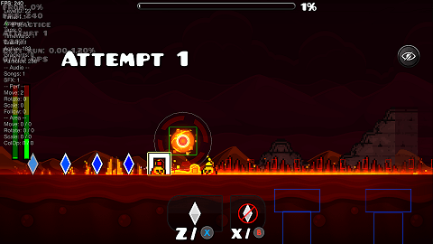
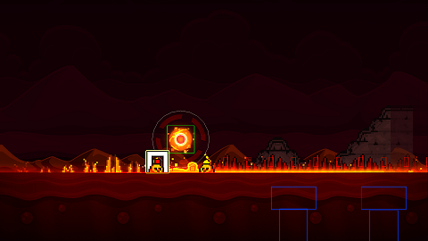

    

# Hide Pause Menu

A Geode mod for Geometry Dash that adds a hide button to the pause menu, for getting a better look at your deaths or capturing clean screenshots. (Also works on the hide End Level Menu button)

## Features
- Configurable button position (Left / Bottom / Right / Off)
- End level menu support with the same hide behavior
- Keybind support for toggling visibility or instant pause and hide
- Auto-hide additional HUD elements (FPS counter, progress bar, percentage, timer, attempts, practice buttons, audio visualizer, and more)

## Same frame before and after mod setup

### Before

### After

## Installation

1. Install [Geode](https://geode-sdk.org/install) for Geometry Dash.
2. Open Geometry Dash, then open the Geode mod list.
3. Search for Hide Pause Menu.
4. Press Install and restart the game.

## Build

- Build instructions are documented here:
[Geode: Creating and Building a Mod](https://docs.geode-sdk.org/getting-started/create-mod)

## Issues & Feature Requests
- Open a [GitHub Issue](https://github.com/Zen-Zo/HidePauseMenuMod/issues)
